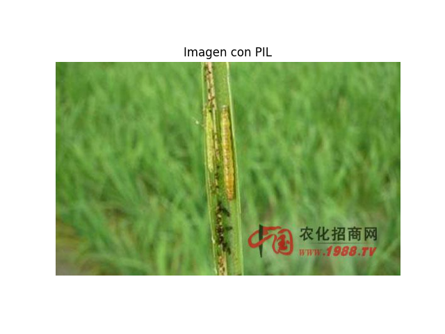
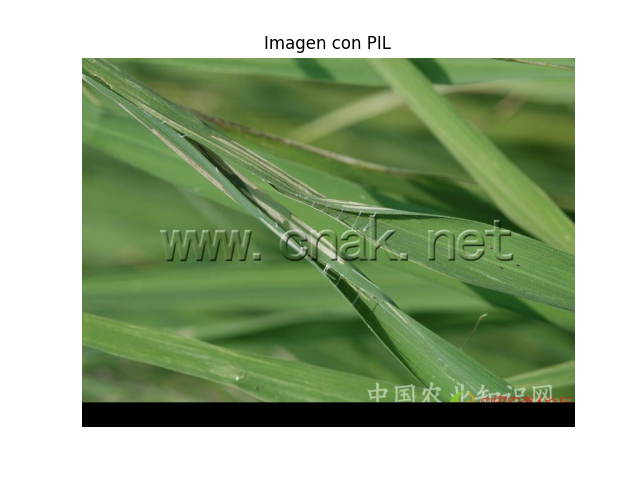
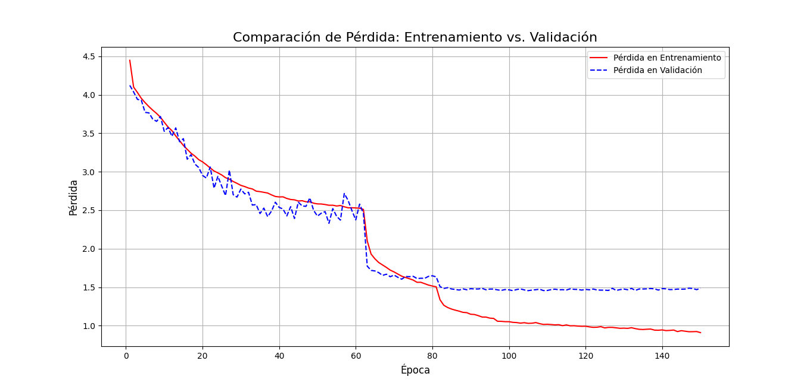

# IP102

El objetivo de este proyecto sera practicar la implementacion manual (sin transfer learning) de diferentes arquitecturas basadas en CNNs (Convolutional Neural Networks) sobre el [dataset IP102](https://www.kaggle.com/datasets/rtlmhjbn/ip02-dataset?select=val.txt) sin necesariamente buscar las mayores precisiones.

Este dataset tiene la siguiente descripción:

"*Context*

*Insect pest are one of the main factors affecting agricultural product. Accurate recognition and classification of insect pests can prevent huge economic losses. This dataset will play a great role in this regard.*

*Content*

*IP02 dataset has 75,222 images and average size of 737 samples per class. The dataset has a split of 6:1:3. There are 8 super classes. Rice, Corn, Wheat, Beet, Alfalfa belong to Field Crop(FC) and Vitis, Citrus, Mango belong to Economic Crop(EC).*"

Resumen:
    * El dataset contiene un total de 75.222 imágenes distribuidas en 102 clases (no balanceadas)
    * Hay 8 superclases: "Rice, Corn, Wheat, Beet, Alfalfa belong to Field Crop(FC) and Vitis, Citrus, Mango belong to Economic Crop(EC) "
    * El dataset tiene una proporción de 6:1:3 (60% train, 10% val, 30% test)

En este proyecto se implementaran diferentes arquitecturas y técnicas de deep learning basadas en CNNs, entre ellas:

* ResNet
* DenseNet


Por otro lado, se implementaron técnicas para favorecer el aprendizaje:

* LR Scheduling
* Weights Initialization
* Normalization
* Regularization : Dropout, Dropblock, Weight Decay
* Parallel Processing 
* DataAugmentation
* Automatic Mixed Precision
* Stochastic Depth regularization

# Carga del conjunto de datos


La estructura de la carpeta que contiene la data (`archive/`), es la siguiente:

```
└───classification
    ├───test
    │   ├───0
    │   ├───1
        ...

    ├───train
    │   ├───0
    │   ├───1
    |   ...

    └───val
        ├───0
        ├───1

```

Para almacenar las rutas de las imágenes usamos el siguiente código:

```python
# utils/load_set.py

import os
from PIL import Image

def load_set(data_path, set_type):
    abs_path = os.path.join(data_path, set_type)
    i = 0
    X_set = []
    Y_set = []
    for label_folder in os.listdir(abs_path):
        label_folder_path = os.path.join(abs_path, label_folder)
        for image in os.listdir(label_folder_path):
            image_path = os.path.join(label_folder_path, image)
            print(f"Set : {set_type}, Class: {label_folder}, Image: {image}", end="\r")
            X_set.append(image_path)
            Y_set.append(label_folder)
        print()
    return X_set, Y_set

```

# Cálculo de métricas para normalizacion

Para normalizar correctamente los registros de entrenamiento, validación y pruebas, se debe primero encontrar la media y desviación estándar por canal en el conjunto de entrenamiento. Usando el siguiente código:


```python

# utils/normalization_metrics_calc.py

import numpy as np
from torch.utils.data import DataLoader
from utils.PathsDataset import PathsDataset

def normalization_metrics_calc(X_paths):
    dataset = PathsDataset(X_paths)
    loader = DataLoader(dataset=dataset, batch_size=1, num_workers=8)

    n_pixels_total = 0
    sum_rgb = np.zeros(3, dtype=np.float64)
    sum_sq_rgb = np.zeros(3, dtype=np.float64)

    for i, image in enumerate(loader):
        print(f"{i}/{len(X_paths)}", end="\r")
        array = image.squeeze(0).numpy().astype(np.float32) / 255.0  # Escalar a [0,1]
        h, w, _ = array.shape
        n_pixels = h * w
        n_pixels_total += n_pixels

        # Suma de valores y suma de cuadrados por canal
        sum_rgb += array.reshape(-1, 3).sum(axis=0)
        sum_sq_rgb += (array.reshape(-1, 3) ** 2).sum(axis=0)

    mean = sum_rgb / n_pixels_total
    std = np.sqrt(sum_sq_rgb / n_pixels_total - mean ** 2)

    return mean.tolist(), std.tolist()
```

```python

# utils/PathsDataset.py

from torch.utils.data import Dataset
from PIL import Image
import numpy as np

class PathsDataset(Dataset):
    """
        Dataset creado para wrapear las rutas de las
        imagenes de entrenamiento para el calculo de media y desviación estándar
    """
    def __init__(self, X) -> None:
        self.x_data = X
    def __len__(self):
        return len(self.x_data)
    def __getitem__(self, idx):
        image = Image.open(self.x_data[idx]).convert('RGB')
        image_arr = np.array(image)
        image.close()
        return image_arr

```

Obtuve los siguientes resultados:

```
means = [0.5058171864589405, 0.5286897495022889, 0.37927134012176345]
stds = [0.26876003294998324, 0.25613632070425424, 0.285797550958417]
```
# Muestras

Usando la siguiente función:

```python

# utils/show_image.py

import matplotlib.pyplot as plt
from PIL import Image

def show_image(path):
    img = Image.open(path)
    plt.imshow(img)
    plt.axis('off')  # Oculta los ejes
    plt.title("Imagen con PIL")
    plt.show()
```

Obtuve las siguientes muestras:





# Análisis de distribucion de target

Usando la siguiente función:

```python
from pandas import Series
def show_target_distribution(target_list):
    t = Series(target_list)

    for k, v in t.value_counts().items():
        print(f"Class : {k}, Per : {v/len(target_list):.5f}")

```


Obtuvimos los siguientes resultados:

```

Mostrando distribución de targets en train
Class : 101, Per : 0.07637
Class : 67, Per : 0.07065
Class : 70, Per : 0.06759
Class : 24, Per : 0.05446
Class : 51, Per : 0.02524
Class : 22, Per : 0.02257
Class : 65, Per : 0.00186
Class : 35, Per : 0.00182
Class : 36, Per : 0.00137
Class : 81, Per : 0.00131
Class : 98, Per : 0.00122
Class : 63, Per : 0.00111
Class : 61, Per : 0.00104
Class : 80, Per : 0.00098
Class : 72, Per : 0.00093
        ...


Mostrando distribución de targets en val
Class : 101, Per : 0.07632
Class : 67, Per : 0.07059
Class : 70, Per : 0.06766
Class : 24, Per : 0.05448
Class : 51, Per : 0.02517
Class : 22, Per : 0.02264
Class : 53, Per : 0.00239
Class : 60, Per : 0.00234
Class : 12, Per : 0.00230
Class : 75, Per : 0.00230
Class : 85, Per : 0.00225
Class : 17, Per : 0.00199
Class : 35, Per : 0.00186
Class : 65, Per : 0.00186
Class : 36, Per : 0.00141
Class : 81, Per : 0.00133
Class : 98, Per : 0.00124
Class : 63, Per : 0.00115
Class : 61, Per : 0.00106
Class : 80, Per : 0.00102
Class : 72, Per : 0.00097

        ...
```

Como se puede apreciar, las clases están sumamente desbalanceadas, esto es algo que se tiene que tener en cuenta para el cálculo de la precisión y para posibles técnicas de data augmentation.

# Creación de dataloaders

Usando el siguiente código:

```python

# main.py

from utils.ImagesDataset import ImagesDataset
from utils.MACROS import BATCH_SIZE, MEANS, STDS
from utils.load_set import load_set
from utils.normalization_metrics_calc import normalization_metrics_calc
from torch.utils.data import DataLoader
from torchvision import transforms

if __name__ == "__main__":
    print('Cargando rutas de imagenes')
    train_X_paths, train_Y = load_set("./archive/classification","train" )
    val_X_paths, val_Y = load_set("./archive/classification","val" )
    test_X_paths, test_Y = load_set("./archive/classification","test" )

#    means, stds = normalization_metrics_calc(train_X_paths)


    train_transformer  = transforms.Compose([
        transforms.Resize((256, 256)), # redimensionar 
        transforms.CenterCrop((224, 224)), # recordar desde el centro para consistencia
        transforms.ToTensor(),
        transforms.Normalize(MEANS, STDS)
    ])

    val_transform = transforms.Compose([
        transforms.Resize((256, 256)), # redimensionar 
        transforms.CenterCrop((224, 224)), # recordar desde el centro para consistencia
        transforms.ToTensor(),
        transforms.Normalize(MEANS, STDS)
    ])

    print('Creando dataloaders')
    train_loader = DataLoader(
            ImagesDataset(train_X_paths, train_Y, train_transformer),
            batch_size=BATCH_SIZE, 
            num_workers=8, 
            shuffle=True,
            persistent_workers=True, 
            pin_memory=True) 

    print('Recorriendo dataset de entrenamiento')
    for i, (X_batch, Y_batch) in enumerate(train_loader):
        pass

```

```python

# utils/ImagesDataset.py

from torch.utils.data import Dataset
from PIL import Image
from torchvision import transforms


class ImagesDataset(Dataset):
    """
        Wrapper para las rutas y labels de imagenes
        para ser usado con dataloader de entrenamiento,
        validacion y pruebas
    """
    def __init__(self, X, Y, transformer) -> None:
        super().__init__()
        self.X = X
        self.Y = Y
        self.transformer = transformer


    def __len__(self):
        return len(self.X)

    def __getitem__(self,idx):
        image = Image.open(self.X[idx]).convert('RGB')
        trans_image = self.transformer(image)
        image.close()
        return trans_image, self.Y[idx]
```

Se crearon los dataloaders para la generación de batches de imágenes. Básicamente se wrappean la lista de rutas y labels en el ImagesDataset y luego el dataloader genera batches, en el proceso de generación de batches se llama al dunder `__getitem__` de la clase ImagesDataset, el cual abre la imagen, la redimensiona, la recorta desde el centro, la convierte a tensor y normaliza para luego retornarla.

El redimensionamiento es necesario para lograr que todos los tensores tengan las mismas dimensiones `(256 x 256 x 3)`.


# Session 1 : Implementación de ResNet.

En su primera version, esta fue mi implementacion manual de `ResNet`:


```python


# utils/ResNet.py

import torch
from torch import nn

from utils.ResBlock import ResBlock

class ResNet(nn.Module):
    def __init__(self, input_dim) -> None:
        super(ResNet, self).__init__()
        self.initial_convolution = nn.Sequential(
            nn.Conv2d(input_dim, 64, kernel_size=7, stride=2, padding=3),
            nn.BatchNorm2d(64),
            nn.ReLU(),
            nn.AvgPool2d(2)
            )
        self.res_pass = nn.Sequential(
            ResBlock(input_channels=64, output_channels=64, downsampling=False),
            ResBlock(input_channels=64, output_channels=64, downsampling=False),
            ResBlock(input_channels=64, output_channels=64, downsampling=False),
            ResBlock(input_channels=64, output_channels=128, downsampling=True),
            ResBlock(input_channels=128, output_channels=128, downsampling=False),
            ResBlock(input_channels=128, output_channels=128, downsampling=False),
            ResBlock(input_channels=128, output_channels=128, downsampling=False),
            )
        self.global_pooling = nn.AdaptiveAvgPool2d((1,1))
        self.linear_pass = nn.Sequential(
            nn.Flatten(),
            nn.Linear(128, 1000),
            nn.ReLU(),
            nn.Linear(1000, 102)
            )
    def forward(self, X):
        out = self.initial_convolution(X)
        out = self.res_pass(out)
        out = self.global_pooling(out)
        return self.linear_pass(out)

    def _init_weights(self):
        pass
```

```python

# utils/ResBlock.py

import torch
from torch import nn
from torch.nn.modules import BatchNorm2d


class ResBlock(nn.Module):
    def __init__(self, input_channels, output_channels, downsampling):
        super(ResBlock, self).__init__()
        self.downsampling = None if not downsampling else nn.Sequential(
            nn.Conv2d(input_channels, output_channels, kernel_size=3, stride=2, padding=1),
            nn.BatchNorm2d(output_channels)
            )
        self.res_pass = nn.Sequential(
                nn.Conv2d(
                            input_channels,
                            output_channels, 
                            kernel_size=3, 
                            stride=2 if self.downsampling else 1,
                            padding = 1),
                nn.BatchNorm2d(output_channels),
                nn.ReLU(),
                nn.Conv2d(
                            output_channels,
                            output_channels, 
                            kernel_size=3, 
                            stride=1,
                            padding = 1),
                nn.BatchNorm2d(output_channels)
                )
        self.relu = nn.ReLU()

    def forward(self, X):
        out = self.res_pass(X)
        if self.downsampling:
            X = self.downsampling(X)
        X = X+out
        return self.relu(X)

    def _init_weights(self):
        pass
```

```python

# main.py

from utils.ImagesDataset import ImagesDataset
import time
from utils.MACROS import BATCH_SIZE, EPOCHS, MEANS, STDS
from utils.ResNet import ResNet
from utils.load_set import load_set
from torch.utils.data import DataLoader
from torchvision import transforms
import torch
import numpy as np

if __name__ == "__main__":
    print('Cargando rutas de imagenes')
    train_X_paths, train_Y = load_set("./archive/classification","train" )
    val_X_paths, val_Y = load_set("./archive/classification","val" )
    test_X_paths, test_Y = load_set("./archive/classification","test" )

#    means, stds = normalization_metrics_calc(train_X_paths)


    train_transformer  = transforms.Compose([
        transforms.Resize((256, 256)), # redimensionar 
        transforms.CenterCrop((224, 224)), # recordar desde el centro para consistencia
        transforms.ToTensor(),
        transforms.Normalize(MEANS, STDS)
    ])

    val_transform = transforms.Compose([
        transforms.Resize((256, 256)), # redimensionar 
        transforms.CenterCrop((224, 224)), # recordar desde el centro para consistencia
        transforms.ToTensor(),
        transforms.Normalize(MEANS, STDS)
    ])

    print('Creando dataloaders')
    train_loader = DataLoader(
            ImagesDataset(train_X_paths, train_Y, train_transformer),
            batch_size=BATCH_SIZE, 
            num_workers=12, 
            shuffle=True,
            persistent_workers=True, 
            pin_memory=True) 

    resnet = ResNet(input_dim=3).cuda()
    optimizer = torch.optim.SGD(resnet.parameters(), lr=5e-4, momentum=0.9)
    criterion = torch.nn.CrossEntropyLoss()

    for a in range(EPOCHS):

        epochs_loss = []

        for i, (X_batch, Y_batch) in enumerate(train_loader):
            t1 = time.time()
            X_batch, Y_batch = X_batch.cuda(), Y_batch.cuda()
            optimizer.zero_grad()

            output = resnet(X_batch)
            loss = criterion(output, Y_batch)
            loss.backward()
            optimizer.step()


            epochs_loss.append(loss.item())

            print(f"Batch : {i}/{len(train_loader)}, Time : {time.time()-t1}")
        
        print(f"Epoch : {a+1}, Loss : {np.mean(epochs_loss)}")
```

Luego se implementó LR Scheduling y procesamiento del conjunto de validación:

```python

# main.py

from utils.ImagesDataset import ImagesDataset
import time
from utils.MACROS import BATCH_SIZE, EPOCHS, MEANS, STDS
from utils.ResNet import ResNet
from utils.load_set import load_set
from torch.utils.data import DataLoader
from torchvision import transforms
import torch
import numpy as np
from torch.optim.lr_scheduler import ReduceLROnPlateau

if __name__ == "__main__":
    print('Cargando rutas de imagenes')
    train_X_paths, train_Y = load_set("./archive/classification","train" )
    val_X_paths, val_Y = load_set("./archive/classification","val" )
    test_X_paths, test_Y = load_set("./archive/classification","test" )

#    means, stds = normalization_metrics_calc(train_X_paths)


    train_transformer  = transforms.Compose([
        transforms.Resize((256, 256)), # redimensionar 
        transforms.CenterCrop((224, 224)), # recordar desde el centro para consistencia
        transforms.ToTensor(),
        transforms.Normalize(MEANS, STDS)
    ])

    val_transform = transforms.Compose([
        transforms.Resize((256, 256)), # redimensionar 
        transforms.CenterCrop((224, 224)), # recordar desde el centro para consistencia
        transforms.ToTensor(),
        transforms.Normalize(MEANS, STDS)
    ])

    print('Creando dataloaders')
    train_loader = DataLoader(
            ImagesDataset(train_X_paths, train_Y, train_transformer),
            batch_size=BATCH_SIZE, 
            num_workers=12, 
            shuffle=True,
            persistent_workers=True, 
            pin_memory=True) 

    val_loader = DataLoader(
            ImagesDataset(val_X_paths, val_Y, val_transform),
            batch_size=BATCH_SIZE, 
            num_workers=12, 
            shuffle=False,
            persistent_workers=True, 
            pin_memory=True) 


    resnet = ResNet(input_dim=3).cuda()
    optimizer = torch.optim.SGD(resnet.parameters(), lr=5e-2, momentum=0.9)
    criterion = torch.nn.CrossEntropyLoss()
    scheduler = ReduceLROnPlateau(optimizer, mode='min',patience=8, min_lr=1e-4 )

    for a in range(EPOCHS):

        epochs_train_loss = []
        epochs_val_loss = []

        resnet.train()
        for i, (X_batch, Y_batch) in enumerate(train_loader):
            t1 = time.time()
            X_batch, Y_batch = X_batch.cuda(), Y_batch.cuda()
            optimizer.zero_grad()

            output = resnet(X_batch)
            loss = criterion(output, Y_batch)
            loss.backward()
            optimizer.step()


            epochs_train_loss.append(loss.item())

            print(f"Batch : {i}/{len(train_loader)}, Time : {time.time()-t1}")


        resnet.eval()

        with torch.no_grad():
            for i, (X_batch, Y_batch) in enumerate(val_loader):
                X_batch, Y_batch = X_batch.cuda(), Y_batch.cuda()
                output = resnet(X_batch)
                loss = criterion(output, Y_batch)

                epochs_val_loss.append(loss.item())


        scheduler.step(np.mean(epochs_val_loss))        
        print(f"Epoch : {a+1}, Train loss : {np.mean(epochs_train_loss)}, Val loss : {np.mean(epochs_val_loss)}")
```


# Session 2 : Inicialización de pesos e implementación final de arquitectura oficial.


Finalmente, implementamos la arquitectura oficial del paper.

```python

# utils/WeightsInitializer.py

from torch import nn
from torch.nn import init

class WeightsInitializer(nn.Module):
    def _init_weights(self):
        for m in self.modules():
            if isinstance(m, nn.Conv2d):
                # Inicializa los pesos de las capas convolucionales
                init.kaiming_normal_(m.weight, mode='fan_out', nonlinearity='relu')
                if m.bias is not None:
                    # Inicializa los sesgos a cero
                    init.constant_(m.bias, 0)
            elif isinstance(m, nn.BatchNorm2d):
                # Inicializa los pesos de batch norm a 1 y sesgos a 0
                init.constant_(m.weight, 1)
                init.constant_(m.bias, 0)
            elif isinstance(m, nn.Linear):
                # Inicializa las capas lineales
                init.kaiming_normal_(m.weight, mode='fan_out', nonlinearity='relu')
                if m.bias is not None:
                    init.constant_(m.bias, 0)
```

```python

# utils/ResBlock.py

import torch
from torch import nn
from torch.nn.modules import BatchNorm2d

from utils.WeightsInitializer import WeightsInitializer


class ResBlock(WeightsInitializer):
    def __init__(self, input_channels, output_channels, downsampling):
        super(ResBlock, self).__init__()
        self.downsampling = None if not downsampling else nn.Sequential(
            nn.Conv2d(input_channels, output_channels, kernel_size=1, stride=2, padding=0),
            nn.BatchNorm2d(output_channels)
            )
        self.res_pass = nn.Sequential(
                nn.Conv2d(
                            input_channels,
                            output_channels, 
                            kernel_size=3, 
                            stride=2 if self.downsampling else 1,
                            padding = 1),
                nn.BatchNorm2d(output_channels),
                nn.ReLU(),
                nn.Conv2d(
                            output_channels,
                            output_channels, 
                            kernel_size=3, 
                            stride=1,
                            padding = 1),
                nn.BatchNorm2d(output_channels)
                )
        self.relu = nn.ReLU()
        self._init_weights()

    def forward(self, X):
        out = self.res_pass(X)
        if self.downsampling:
            X = self.downsampling(X)
        X = X+out
        return self.relu(X)

```

```python

# utils/ResNet.py

import torch
from torch import nn
from utils.WeightsInitializer import WeightsInitializer
from utils.ResBlock import ResBlock

class ResNet(WeightsInitializer):
    def __init__(self, input_dim) -> None:
        super(ResNet, self).__init__()
        self.initial_convolution = nn.Sequential(
            nn.Conv2d(input_dim, 64, kernel_size=7, stride=2, padding=3),
            nn.BatchNorm2d(64),
            nn.ReLU(),
            nn.MaxPool2d(2)
            )
        self.res_pass = nn.Sequential(
            ResBlock(input_channels=64, output_channels=64, downsampling=False),
            ResBlock(input_channels=64, output_channels=64, downsampling=False),
            ResBlock(input_channels=64, output_channels=64, downsampling=False),
            ResBlock(input_channels=64, output_channels=128, downsampling=True),
            ResBlock(input_channels=128, output_channels=128, downsampling=False),
            ResBlock(input_channels=128, output_channels=128, downsampling=False),
            ResBlock(input_channels=128, output_channels=128, downsampling=False),
            ResBlock(input_channels=128, output_channels=256, downsampling=True),
            ResBlock(input_channels=256, output_channels=256, downsampling=False),
            ResBlock(input_channels=256, output_channels=256, downsampling=False),
            ResBlock(input_channels=256, output_channels=256, downsampling=False),
            ResBlock(input_channels=256, output_channels=256, downsampling=False),
            ResBlock(input_channels=256, output_channels=256, downsampling=False),
            ResBlock(input_channels=256, output_channels=512, downsampling=True),
            ResBlock(input_channels=512, output_channels=512, downsampling=False),
            ResBlock(input_channels=512, output_channels=512, downsampling=False),
            )
        self.global_pooling = nn.AdaptiveAvgPool2d((1,1))
        self.linear_pass = nn.Sequential(
            nn.Flatten(),
            nn.Linear(512, 102),
            )
        self._init_weights()
    def forward(self, X):
        out = self.initial_convolution(X)
        out = self.res_pass(out)
        out = self.global_pooling(out)
        return self.linear_pass(out)
```

# Session 3: Implementación de DataAugmentation.

Usando el siguiente código:

```python

# main.py

...

if __name__ == "__main__":

...

    train_transformer  = transforms.Compose([

        # basic resize
        
        transforms.Resize((256, 256)), # redimensionar 
        transforms.CenterCrop((224, 224)), # recordar desde el centro para consistencia
        
        # data aumentation

        transforms.RandomResizedCrop(224),
        transforms.RandomHorizontalFlip(),
        transforms.ColorJitter(0.4, 0.4, 0.4, 0.1),
        transforms.RandomRotation(15),


        transforms.ToTensor(),
        transforms.Normalize(MEANS, STDS)
    ])


```

El data augmentation es una técnica que se utiliza para transformar las imágenes existentes en el dataset, en este caso, haciendo recortes aleatorios, haciendo cambios de orientación, etc. 

El data augmentation se hace para hacer al modelo más robusto, ante posibles casos de uso de la vida real. Para dar un ejemplo practico, es como decirle al modelo: esta persona sigue siendo una persona a pesar de estar en blanco y negro y estar rotada.

Como el data augmentation ayuda a mejorar las capacidades de generalización del modelo, otra forma de verlo es que reduce el overfitting.


# Session 4: Implementación de métrica de precisión.

Usando el siguiente código:

```python

...

if __name__ == "__main__":

...
        resnet.eval()

        with torch.no_grad():
            for i, (X_batch, Y_batch) in enumerate(val_loader):
                X_batch, Y_batch = X_batch.to(DEVICE), Y_batch.to(DEVICE)
                output = resnet(X_batch)
                loss = criterion(output, Y_batch)

                batches_val_loss.append(loss.item())

                _, predicted_labels = torch.max(output, 1)
                ps = precision_score(Y_batch.to('cpu'), predicted_labels.to('cpu'), average='macro',  zero_division=0)
                batches_val_prec.append(ps)


        print("\n\n")
        scheduler.step(np.mean(batches_val_loss))        
        print(f"""Epoch : {a+1}

                    Train loss : {np.mean(batches_train_loss)}
                    Val loss : {np.mean(batches_val_loss)}
                    Val prec : {np.mean(batches_val_prec)}

                    """)
```

Usando la función `precision_score` de sklearn se toma la precisión del modelo para cada clase y se promedia (usando el parámetro `average='macro'`).

# Session 5 : primeras pruebas con ResNet34.

Finalmente, esta terminó siendo la arquitectura:

```python


class ResNet34(WeightsInitializer):
    def __init__(self, input_dim) -> None:
        super(ResNet34, self).__init__()
        self.initial_convolution = nn.Sequential(
            nn.Conv2d(input_dim, 64, kernel_size=7, stride=2, padding=3),
            nn.BatchNorm2d(64),
            nn.ReLU(),
            nn.MaxPool2d(2)
            )
        self.res_pass = nn.Sequential(
            ResBlock(input_channels=64, output_channels=64, downsampling=False),
            ResBlock(input_channels=64, output_channels=64, downsampling=False),
            ResBlock(input_channels=64, output_channels=64, downsampling=False),
            ResBlock(input_channels=64, output_channels=128, downsampling=True),
            DropBlock2D(0.3, block_size=15),
            ResBlock(input_channels=128, output_channels=128, downsampling=False),
            ResBlock(input_channels=128, output_channels=128, downsampling=False),
            ResBlock(input_channels=128, output_channels=128, downsampling=False),
            ResBlock(input_channels=128, output_channels=256, downsampling=True),
            DropBlock2D(0.3, block_size=8),
            ResBlock(input_channels=256, output_channels=256, downsampling=False),
            ResBlock(input_channels=256, output_channels=256, downsampling=False),
            ResBlock(input_channels=256, output_channels=256, downsampling=False),
            ResBlock(input_channels=256, output_channels=256, downsampling=False),
            ResBlock(input_channels=256, output_channels=256, downsampling=False),
            ResBlock(input_channels=256, output_channels=512, downsampling=True),
            DropBlock2D(0.3, block_size=4),
            ResBlock(input_channels=512, output_channels=512, downsampling=False),
            ResBlock(input_channels=512, output_channels=512, downsampling=False),
            )
        self.global_pooling = nn.AdaptiveAvgPool2d((1,1))
        self.linear_pass = nn.Sequential(
            nn.Flatten(),
            nn.Linear(512, 102),
            )
        self._init_weights()
    def forward(self, X):
        out = self.initial_convolution(X)
        out = self.res_pass(out)
        out = self.global_pooling(out)
        return self.linear_pass(out)

```


```python

from utils.ImagesDataset import ImagesDataset
from utils.plot_model_performance import plot_model_performance
import time
from utils.MACROS import BATCH_SIZE, EPOCHS, MEANS, STDS
from utils.resnets.ResNet34 import ResNet34
from utils.load_set import load_set
from torch.utils.data import DataLoader
from torchvision import transforms
import torch
import numpy as np
from torch.optim.lr_scheduler import ReduceLROnPlateau
from sklearn.metrics import precision_score


if __name__ == "__main__":


    DEVICE = 'cuda' if torch.cuda.is_available() else 'cpu'


    print('Cargando rutas de imagenes')
    train_X_paths, train_Y = load_set("./archive/classification","train" )
    val_X_paths, val_Y = load_set("./archive/classification","val" )
    test_X_paths, test_Y = load_set("./archive/classification","test" )

#    means, stds = normalization_metrics_calc(train_X_paths)


    train_transformer  = transforms.Compose([

        # basic resize
        
        transforms.Resize((256, 256)), # redimensionar 
        transforms.CenterCrop((224, 224)), # recordar desde el centro para consistencia
        
        # data aumentation

        transforms.RandomHorizontalFlip(),
        transforms.ColorJitter(0.4, 0.4, 0.4, 0.1),
        transforms.RandomRotation(15),


        transforms.ToTensor(),
        transforms.Normalize(MEANS, STDS)
    ])

    val_transform = transforms.Compose([
        transforms.Resize((256, 256)), # redimensionar 
        transforms.CenterCrop((224, 224)), # recordar desde el centro para consistencia

        transforms.ToTensor(),
        transforms.Normalize(MEANS, STDS)
    ])

    print('Creando dataloaders')
    train_loader = DataLoader(
            ImagesDataset(train_X_paths, train_Y, train_transformer),
            batch_size=BATCH_SIZE, 
            num_workers=12, 
            shuffle=True,
            persistent_workers=True, 
            pin_memory=True) 

    val_loader = DataLoader(
            ImagesDataset(val_X_paths, val_Y, val_transform),
            batch_size=BATCH_SIZE, 
            num_workers=12, 
            shuffle=False,
            persistent_workers=True, 
            pin_memory=True) 


    resnet = ResNet34(input_dim=3).to(DEVICE)
    optimizer = torch.optim.SGD(resnet.parameters(), lr=5e-2, momentum=0.9, weight_decay=5e-4)
    criterion = torch.nn.CrossEntropyLoss()
    scheduler = ReduceLROnPlateau(optimizer, mode='min',patience=8, min_lr=1e-4 )

    epochs_train_loss = []
    epochs_val_loss = []

    for a in range(EPOCHS):

        batches_train_loss = []
        batches_val_loss = []
        batches_val_prec = []

        resnet.train()
        for i, (X_batch, Y_batch) in enumerate(train_loader):
            t1 = time.time()
            X_batch, Y_batch = X_batch.to(DEVICE), Y_batch.to(DEVICE)
            optimizer.zero_grad()

            output = resnet(X_batch)
            loss = criterion(output, Y_batch)
            loss.backward()
            optimizer.step()


            batches_train_loss.append(loss.item())

            print(f"Train Batch : {i}/{len(train_loader)}, Time : {time.time()-t1}", end="\r")


        resnet.eval()

        print("\n\n")

        with torch.no_grad():
            for i, (X_batch, Y_batch) in enumerate(val_loader):
                t1 = time.time()
                X_batch, Y_batch = X_batch.to(DEVICE), Y_batch.to(DEVICE)
                output = resnet(X_batch)
                loss = criterion(output, Y_batch)

                batches_val_loss.append(loss.item())

                _, predicted_labels = torch.max(output, 1)
                ps = precision_score(Y_batch.to('cpu'), predicted_labels.to('cpu'), average='macro',  zero_division=0)
                batches_val_prec.append(ps)

                print(f"Val Batch : {i}/{len(val_loader)}, Time : {time.time()-t1}", end="\r")


        print("\n\n")
        scheduler.step(np.mean(batches_val_loss))        
        print(f"""Epoch : {a+1}

                    Train loss : {np.mean(batches_train_loss)}
                    Val loss : {np.mean(batches_val_loss)}
                    Val prec : {np.mean(batches_val_prec)}

                    """)
        epochs_train_loss.append(np.mean(batches_train_loss))
        epochs_val_loss.append(np.mean(batches_val_loss))
    torch.save(resnet, "./resnet34.pth")

    plot_model_performance(epochs_train_loss, epochs_val_loss)
```

Con ella se lograron los siguientes resultados:

```
Epoch : 150

                    Train loss : 0.9101786265981958
                    Val loss : 1.4869100049895756
                    Val prec : 0.12333178385395152
```



# Implementación de DensetNet121

Usando el siguiente código, se implemento `DenseNet121`:

```python


from utils.WeightsInitializer import WeightsInitializer
from torch import nn
from utils.densnets.DenseBlock import DenseBlock
from utils.densnets.DenseTransition import DenseTransition

class DenseNet121(WeightsInitializer):
    def __init__(self, in_channels, k=32, compression=0.5, dense_layers=[6, 12, 24, 16]):
        super(DenseNet121, self).__init__()
        self.initial_conv = nn.Sequential(
                nn.Conv2d(in_channels, out_channels=64, kernel_size=7, padding=3, stride=2),
                nn.BatchNorm2d(64),
                nn.ReLU(inplace=True),
                nn.MaxPool2d(kernel_size=3, stride=2, padding=1)
                )
        self.dense_pass = nn.Sequential()
        out = 64
        for i,dl in enumerate(dense_layers):
            self.dense_pass.append(DenseBlock(in_channels=out,growth_rate=k,num_layers=dl))
            if i != len(dense_layers)-1:
                self.dense_pass.append(DenseTransition(in_channels=int(out + dl*k), compression=compression))
                out = (out + dl*k)*compression

        self.linear_pass = nn.Sequential(
                nn.AdaptiveAvgPool2d((1,1)),
                nn.Flatten(),
                nn.Linear(int(out + dense_layers[-1]*k), 102),
                )
        self._init_weights()


    def forward(self, X):
        out = self.initial_conv(X)
        out = self.dense_pass(out)
        out = self.linear_pass(out)
        return out
```

Teniendo en cuenta que el objetivo principal de este proyecto era practicar la implementación sin necesariamente alcanzar las mayores precisiones, queda hasta aquí.

