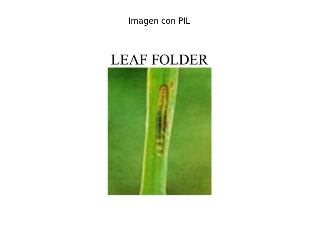

# IP102

El objetivo de este proyecto sera alcanzar la mejor precision posible en la clasificacion de imagenes del [dataset IP102](https://www.kaggle.com/datasets/rtlmhjbn/ip02-dataset?select=val.txt).

Este dataset tiene la siguiente descripcion:

"*Context*

*Insect pest are one of the main factors affecting agricultural product. Accurate recognition and classification of insect pests can prevent huge economic losses. This dataset will play a great role in this regard.*

*Content*

*IP02 dataset has 75,222 images and average size of 737 samples per class. The dataset has a split of 6:1:3. There are 8 super classes. Rice, Corn, Wheat, Beet, Alfalfa belong to Field Crop(FC) and Vitis, Citrus, Mango belong to Economic Crop(EC).*"

Resumen:
    * El dataset contiene un total de 75.222 imagenes distribuidas en 102 clases (no balanceadas)
    * Hay 8 superclases: "Rice, Corn, Wheat, Beet, Alfalfa belong to Field Crop(FC) and Vitis, Citrus, Mango belong to Economic Crop(EC) "
    * El dataset tiene una proporcion de 6:1:3 (60% train, 10% val, 30% test)

En este proyecto se implementaran diferentes arquitecturas y tecnicas de deep learning basadas en CNNs, entre ellas:

* ResNet
* EfficientNet
* DenseNet
* ResNext
* VGG
* Separable Convolutions


Por otro lado, se implementaran tecnicas para favorecer el aprendizaje:

* LR Scheduling
* Weights Initialization
* Normalization
* Regularization : Dropout, Dropblock, Weight Decay
* Parallel Processing 
* DataAugmentation
* Automatic Mixed Precision
* Stochastic Depth regularization

# Carga del conjunto de datos


La estructura de la carpeta que contiene la data (`archive/`), es la siguiente:

```
└───classification
    ├───test
    │   ├───0
    │   ├───1
        ...

    ├───train
    │   ├───0
    │   ├───1
    |   ...

    └───val
        ├───0
        ├───1

```

Para almacenar las rutas de las imagenes usamos el siguiente codigo:

```python
# utils/load_set.py

import os
from PIL import Image

def load_set(data_path, set_type):
    abs_path = os.path.join(data_path, set_type)
    i = 0
    X_set = []
    Y_set = []
    for label_folder in os.listdir(abs_path):
        label_folder_path = os.path.join(abs_path, label_folder)
        for image in os.listdir(label_folder_path):
            image_path = os.path.join(label_folder_path, image)
            print(f"Set : {set_type}, Class: {label_folder}, Image: {image}", end="\r")
            X_set.append(image_path)
            Y_set.append(label_folder)
        print()
    return X_set, Y_set

```

# Calculo de metricas para normalizacion

Para normalizar correctamente los registros de entrenamiento, validacion y pruebas, se debe primero encontrar la media y desviacion estandar por canal en el conjunto de entrenamiento. Usando el siguiente codigo:


```python

# utils/normalization_metrics_calc.py

import numpy as np
from torch.utils.data import DataLoader
from utils.PathsDataset import PathsDataset

def normalization_metrics_calc(X_paths):
    dataset = PathsDataset(X_paths)
    loader = DataLoader(dataset=dataset, batch_size=1, num_workers=8)

    n_pixels_total = 0
    sum_rgb = np.zeros(3, dtype=np.float64)
    sum_sq_rgb = np.zeros(3, dtype=np.float64)

    for i, image in enumerate(loader):
        print(f"{i}/{len(X_paths)}", end="\r")
        array = image.squeeze(0).numpy().astype(np.float32) / 255.0  # Escalar a [0,1]
        h, w, _ = array.shape
        n_pixels = h * w
        n_pixels_total += n_pixels

        # Suma de valores y suma de cuadrados por canal
        sum_rgb += array.reshape(-1, 3).sum(axis=0)
        sum_sq_rgb += (array.reshape(-1, 3) ** 2).sum(axis=0)

    mean = sum_rgb / n_pixels_total
    std = np.sqrt(sum_sq_rgb / n_pixels_total - mean ** 2)

    return mean.tolist(), std.tolist()
```

```python

# utils/PathsDataset.py

from torch.utils.data import Dataset
from PIL import Image
import numpy as np

class PathsDataset(Dataset):
    """
        Dataset creado para wrapear las rutas de las
        imagenes de entrenamiento para el calculo de media y desviacion estandar
    """
    def __init__(self, X) -> None:
        self.x_data = X
    def __len__(self):
        return len(self.x_data)
    def __getitem__(self, idx):
        image = Image.open(self.x_data[idx]).convert('RGB')
        image_arr = np.array(image)
        image.close()
        return image_arr

```

Obtuve los siguientes resultados:

```
means = [0.5058171864589405, 0.5286897495022889, 0.37927134012176345]
stds = [0.26876003294998324, 0.25613632070425424, 0.285797550958417]
```
# Muestras

Usando la siguiente funcion:

```python

# utils/show_image.py

import matplotlib.pyplot as plt
from PIL import Image

def show_image(path):
    img = Image.open(path)
    plt.imshow(img)
    plt.axis('off')  # Oculta los ejes
    plt.title("Imagen con PIL")
    plt.show()
```

Obtuve las siguientes muestras:





# Analisis de distribucion de target

# Creacion de dataloaders

Usando el siguiente codigo:

```python

# main.py

from utils.ImagesDataset import ImagesDataset
from utils.MACROS import BATCH_SIZE, MEANS, STDS
from utils.load_set import load_set
from utils.normalization_metrics_calc import normalization_metrics_calc
from torch.utils.data import DataLoader
from torchvision import transforms

if __name__ == "__main__":
    print('Cargando rutas de imagenes')
    train_X_paths, train_Y = load_set("./archive/classification","train" )
    val_X_paths, val_Y = load_set("./archive/classification","val" )
    test_X_paths, test_Y = load_set("./archive/classification","test" )

#    means, stds = normalization_metrics_calc(train_X_paths)


    train_transformer  = transforms.Compose([
        transforms.Resize((256, 256)), # redimensionar 
        transforms.CenterCrop((224, 224)), # recordar desde el centro para consistencia
        transforms.ToTensor(),
        transforms.Normalize(MEANS, STDS)
    ])

    val_transform = transforms.Compose([
        transforms.Resize((256, 256)), # redimensionar 
        transforms.CenterCrop((224, 224)), # recordar desde el centro para consistencia
        transforms.ToTensor(),
        transforms.Normalize(MEANS, STDS)
    ])

    print('Creando dataloaders')
    train_loader = DataLoader(
            ImagesDataset(train_X_paths, train_Y, train_transformer),
            batch_size=BATCH_SIZE, 
            num_workers=8, 
            shuffle=True,
            persistent_workers=True, 
            pin_memory=True) 

    print('Recorriendo dataset de entrenamiento')
    for i, (X_batch, Y_batch) in enumerate(train_loader):
        pass

```

```python

# utils/ImagesDataset.py

from torch.utils.data import Dataset
from PIL import Image
from torchvision import transforms


class ImagesDataset(Dataset):
    """
        Wrapper para las rutas y labels de imagenes
        para ser usado con dataloader de entrenamiento,
        validacion y pruebas
    """
    def __init__(self, X, Y, transformer) -> None:
        super().__init__()
        self.X = X
        self.Y = Y
        self.transformer = transformer


    def __len__(self):
        return len(self.X)

    def __getitem__(self,idx):
        image = Image.open(self.X[idx]).convert('RGB')
        trans_image = self.transformer(image)
        image.close()
        return trans_image, self.Y[idx]
```

Se crearon los dataloaders para la generacion de batches de imagenes. Basicamente se wrappean la lista de rutas y labels en el ImagesDataset y luego el dataloader genera batches, en el proceso de generacion de batches se llama al dunder `__getitem__` de la clase ImagesDataset, el cual abre la imagen, la redimensiona, la recorta desde el centro, la convierte a tensor y normaliza para luego retornarla.

El redimensionamiento es necesario para lograr que todos los tensores tengan las mismas dimensiones `(256 x 256 x 3)`.

